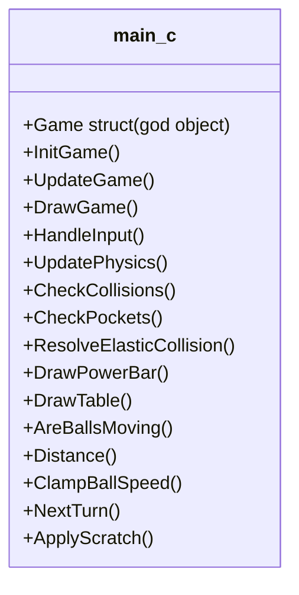
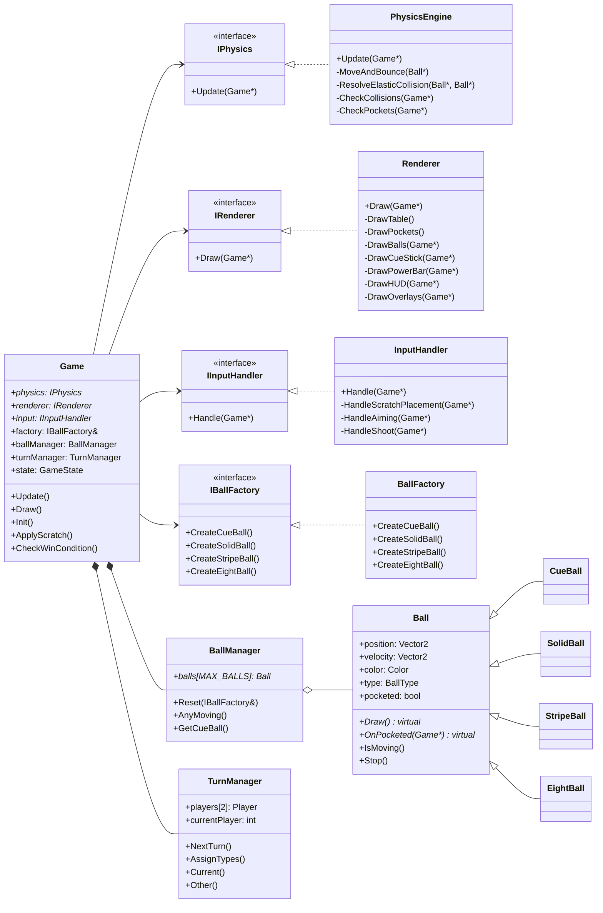
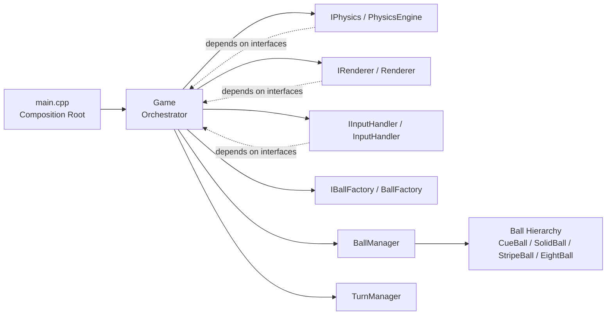
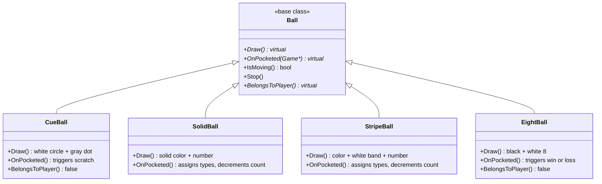
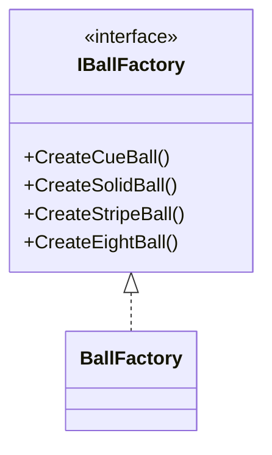

# 0714-02-CSE-2100
Course Code: 0714 02 CSE 2100 || Course Title : Advanced Programming Laboratory
 || ID : 240232 , 240235

# 8-Ball Pool Game: C to C++ Transition with OOD and SOLID Implementation

**Course:** Advanced Programming Lab (2nd Year CSE)  
**Project:** 8-Ball Pool Game (raylib / C → C++)

## Folder Structure (Key Areas)

```
SOLID/
	main.cpp
	config.h
	types.h
	interfaces/
		IPhysics.h
		IRenderer.h
		IInputHandler.h
	balls/
		Ball.h / Ball.cpp
		CueBall.h / CueBall.cpp
		SolidBall.h
		StripeBall.h
		EightBall.h / EightBall.cpp
	managers/
		BallManager.h
		Player.h
		TurnManager.h
	factories/
		IBallFactory.h
		BallFactory.h
	core/
		Game.h
		PhysicsEngine.h / .cpp
		Renderer.h / .cpp
		InputHandler.h / .cpp
	build.bat
```

## Executive Overview

This report presents a structured transition from a procedural single-file C implementation to a modern C++ architecture for the 8-Ball Pool game, with explicit focus on:

1. Object-Oriented Design (OOD)
2. SOLID principles implementation
3. Incremental migration without gameplay regression
4. Maintainability, testability, and extensibility

The goal is not only to modernize syntax, but to redraw responsibility boundaries so the game stays correct, scalable, and easier to extend. The original 661-line monolith (`Previous_project/main.c`) was first split into a clean multi-file C project (`New_project/`), then re-architected in C++ with full OOP, interface-driven design, and dependency injection (`SOLID/`).

---

## Why Transition from C to C++

The transition is justified by both engineering and academic value.

### Engineering motivations

1. Better encapsulation and state safety through classes and access control.
2. Cleaner module boundaries using interfaces and polymorphism.
3. Reduced memory risk via RAII (`BallManager` destructor, deleted copy semantics).
4. Easier feature extension — new ball types, rendering styles, or rule variants without touching stable code.
5. Better testability through dependency injection and interface contracts.

### Academic motivations

1. Demonstrates practical OOD inside a real-time interactive game project using raylib.
2. Demonstrates all five SOLID principles applied to a domain mixing physics simulation with game rule logic.
3. Demonstrates how design patterns (Strategy, Template Method, Facade, Factory) resolve real architectural problems.

---

## Transition Objectives

### Primary objectives

1. Preserve gameplay correctness — physics, pocketing, turn logic, and win/loss conditions must match the C baseline.
2. Replace the overloaded `Game` struct with focused domain classes.
3. Introduce clear abstraction layers:
- Presentation and input
- Game logic and rules
- Core physics and ball domain
4. Implement all five SOLID principles in concrete code structure.

### Non-objectives

1. No risky big-bang rewrite — the C version stays compilable as a reference throughout.
2. No algorithmic redesign of physics simulation logic — friction, elastic collision math, and pocket detection remain identical.
3. No removal of working behavior before a tested replacement is ready.

---

## Target OOD Architecture

### Layered model

1. **Presentation Layer**
- `Renderer` — table, rails, pockets, balls, cue stick, power bar, HUD, win/scratch overlays
- `InputHandler` — mouse aiming, drag-to-shoot mechanics, scratch ball placement, recoil animation

2. **Application/Service Layer**
- `Game` — orchestrates all subsystems, drives Update/Draw loop
- `TurnManager` — player turns, Solids/Stripes type assignment

3. **Domain Layer**
- `Ball` hierarchy — base class and four concrete subclasses, each with its own `OnPocketed()` logic
- `BallManager` — lifetime ownership, rack reset via `IBallFactory`, movement queries

4. **Infrastructure Layer**
- `PhysicsEngine` — movement, friction, wall bouncing, elastic collision, pocket detection
- `config.h` — all tunable constants in one place
- `types.h` — typed enums for ball type, game state, player type

### Dependency rule

Dependencies flow downward only:

`Presentation → Application → Domain → Infrastructure`

No domain class carries any knowledge of rendering or input concerns above it.

### UML Diagrams

#### Diagram 1: Before — C monolith



Everything — physics, rendering, input, game rules, player state — lived in one file with one struct.

---

#### Diagram 2: After — SOLID C++ (interface-driven)



---

#### Diagram 3: Layered dependency flow



---

#### Diagram 4: Ball class hierarchy



---

## Core Class and Interface Design

### Key interfaces (contracts)

| Interface | Contract | Implemented by |
|---|---|---|
| `IPhysics` | `Update(Game*)` — simulate one frame of physics | `PhysicsEngine` |
| `IRenderer` | `Draw(Game*)` — render one complete frame | `Renderer` |
| `IInputHandler` | `Handle(Game*)` — process input for one frame | `InputHandler` |
| `IBallFactory` | `CreateXxx()` — construct ball instances | `BallFactory` |

### Key classes (concrete)

| Class | Layer | Sole Responsibility |
|---|---|---|
| `Ball` + subclasses | Domain | Encapsulate ball state, polymorphic rendering, own pocket behavior |
| `BallManager` | Domain | Own all `Ball*` heap objects, rack reset via factory, movement queries |
| `TurnManager` | Application | Track current player, turn switching, type assignment |
| `PhysicsEngine` | Infrastructure | Movement, friction, wall bounce, elastic collision, pocket detection |
| `Renderer` | Presentation | All raylib draw calls — no game logic |
| `InputHandler` | Presentation | Mouse input processing and recoil animation — no game logic |
| `Game` | Application | Orchestrate all subsystems via interface pointers |
| `BallFactory` | Factory | Construct concrete ball instances — only `main.cpp` depends on it |

---

## SOLID Implementation Plan

## S: Single Responsibility Principle (SRP)

### Problem pattern
The monolithic `Game` struct in the C version mixed physics state, rendering state, input state, player data, and game rule state — plus the stickRecoil animation — all in one place.

### Implementation
1. Each class has one clear job: `InputHandler` handles input and recoil animation, `TurnManager` manages turns, `BallManager` manages ball lifetime, `PhysicsEngine` simulates physics, `Renderer` draws everything.
2. Recoil animation moved from `Game::Update()` into `InputHandler::Handle()` — an input/visual concern belongs with input.
3. `config.h` holds constants only. `types.h` holds enums only. Each `Ball` subclass draws itself only.

### Expected result
Every class has a single, clear reason to change. Editing stripe rendering in `StripeBall::Draw()` has no pathway to affect physics behavior.

---

## O: Open/Closed Principle (OCP)

### Problem pattern
`PhysicsEngine::CheckPockets()` had a hardcoded `if (ball->type == BallType::EIGHT)` / `if (ball->type == BallType::CUE)` chain. Adding any new special ball required modifying this method directly.

### Implementation
1. Added `virtual void OnPocketed(Game*)` to the `Ball` base class. Each subclass handles its own pocket consequence.
2. `CueBall::OnPocketed()` triggers scratch. `EightBall::OnPocketed()` triggers win/loss. `SolidBall`/`StripeBall` use the base `Ball::OnPocketed()` for type assignment and count decrement.
3. `PhysicsEngine::CheckPockets()` now just calls `ball->OnPocketed(game)` — zero type-switching.

```
Ball (base)
  ◄── CueBall       → OnPocketed: scratch
  ◄── SolidBall     → OnPocketed: assign type, decrement count
  ◄── StripeBall    → OnPocketed: assign type, decrement count
  ◄── EightBall     → OnPocketed: win or loss
  ◄── [AnyNewBall]  → extend here; PhysicsEngine never changes
```

### Expected result
New ball types are added by creating a new subclass. `PhysicsEngine`, `Renderer`, and `BallManager` never need modification.

---

## L: Liskov Substitution Principle (LSP)

### Implementation
1. Every `Ball` subtype upholds the same preconditions and postconditions as the base — `BallManager` iterates `Ball*` and every subtype behaves correctly.
2. `IPhysics*`, `IRenderer*`, `IInputHandler*` in `Game` can be substituted with any conforming implementation without changing the game loop.
3. `BallManager` never casts to a subtype — safe substitution is guaranteed across all ball variants.

### Expected result
Any evaluator, renderer, or input implementation can be swapped safely without breaking the system.

---

## I: Interface Segregation Principle (ISP)

### Implementation
1. Three focused interfaces expose only what each consumer needs:

```
IPhysics       → Update(Game*)     — physics only
IRenderer      → Draw(Game*)       — rendering only
IInputHandler  → Handle(Game*)     — input only
IBallFactory   → CreateXxx()       — construction only
```

2. `Renderer` never needs physics methods. `PhysicsEngine` never needs draw methods. Each subsystem depends only on the interface it implements.
3. `Ball::BelongsToPlayer()` exposes only the ownership flag — rule logic queries only what it needs without knowing the specific subtype.

### Expected result
Reduced coupling. Each module compiles against a minimal interface surface.

---

## D: Dependency Inversion Principle (DIP)

### Problem pattern
`BallManager::Reset()` directly `#include`d all concrete ball types and called `new CueBall()`, `new SolidBall()` etc. — depending on concretions, not abstractions.

### Implementation
1. `IBallFactory` interface introduced. `BallManager::Reset()` now takes `const IBallFactory&` — it knows nothing about concrete ball classes.
2. `BallFactory` is the concrete implementation — only `main.cpp` includes it.
3. `main.cpp` is the composition root: constructs all concrete objects and injects them through interfaces into `Game`.

```cpp
// main.cpp — composition root
PhysicsEngine physics;
Renderer      renderer;
InputHandler  input;
BallFactory   factory;

Game game(&physics, &renderer, &input, factory);
// Game depends only on IPhysics*, IRenderer*, IInputHandler*, IBallFactory&
```

### Expected result
`Game`, `BallManager`, and all domain classes depend only on abstractions. Swapping `BallFactory` for a `TestBallFactory` or `PhysicsEngine` for a `SlowMotionPhysics` requires zero changes to any game logic.

---

## Design Patterns Used

1. **Strategy Pattern** — `IPhysics`, `IRenderer`, `IInputHandler` are strategy interfaces. Concrete strategy is selected at construction time in `main.cpp` and injected into `Game`.

2. **Template Method Pattern** — `Ball::Draw()` and `Ball::OnPocketed()` are declared virtual. Each subclass overrides them to produce its specific visual and pocket behavior. `Renderer::DrawBalls()` and `PhysicsEngine::CheckPockets()` call through the base pointer.

3. **Factory Pattern** — `IBallFactory` / `BallFactory` centralize ball construction. `BallManager` is decoupled from all concrete ball types.

4. **Facade Pattern** — `Game` acts as a simplified facade. The main loop calls only two methods:

```cpp
while (!WindowShouldClose()) {
    game.Update();
    game.Draw();
}
```

5. **RAII** — `BallManager` owns all `Ball*` heap objects. Its destructor deletes every ball automatically. Copy constructor and copy assignment are explicitly deleted to prevent double-free.

---

## Migration Roadmap (Phased)

## Phase 1: Baseline and Safety Net

1. Freeze the working C version (`Previous_project/main.c`) as the functional baseline.
2. Document expected gameplay behavior: break shot, pocket logic, type assignment, scratch placement, win/loss conditions.
3. Establish build verification for both C and C++ versions.

**Deliverable:** confirmed working 661-line C baseline.

---

## Phase 2: C Modular Refactor

1. Split `main.c` into 5 source files + 6 headers: `game.c/h`, `physics.c/h`, `graphics.c/h`, `utils.c/h`, `common.h`, `config.h`.
2. Extract all constants to `config.h`. Rename abbreviated identifiers to descriptive names.
3. Upgrade build system to `Makefile` + `build.bat`.

**Deliverable:** clean multi-file C project, verified gameplay.

---

## Phase 3: Type Modernization

1. Convert C-style enums to `enum class` in `types.h` (`BallType`, `GameState`, `PlayerType`).
2. Introduce `std::string` for player names.

**Deliverable:** modernized type layer with no behavior change.

---

## Phase 4: Interface Introduction

1. Add `IPhysics`, `IRenderer`, `IInputHandler`, `IBallFactory` in `interfaces/` and `factories/`.
2. Keep concrete implementations intact, wire through interfaces.
3. Confirm `main.cpp` composition root pattern compiles and links cleanly.

**Deliverable:** compile-safe abstraction layer with full dependency injection.

---

## Phase 5: Ball Hierarchy and BallManager

1. Introduce `Ball` base class with virtual `Draw()`, `OnPocketed()`, and `BelongsToPlayer()`.
2. Introduce `CueBall`, `SolidBall`, `StripeBall`, `EightBall` subclasses — each overrides `Draw()` and `OnPocketed()`.
3. Introduce `BallManager` with RAII cleanup and `IBallFactory`-based `Reset()`.

**Deliverable:** clean domain hierarchy, rendering and pocket behavior delegated to each ball subclass.

---

## Phase 6: TurnManager and Player Extraction

1. Extract player data and turn switching into a dedicated `TurnManager` class.
2. `TurnManager` exposes `Current()`, `Other()`, `NextTurn()`, `SwitchOnScratch()`, `AssignTypes()`, `PlayerIndexForType()`.

**Deliverable:** player and turn state fully encapsulated.

---

## Phase 7: Hardening and Cleanup

1. Move stickRecoil animation from `Game::Update()` into `InputHandler::Handle()` — SRP fix.
2. Remove hardcoded type-switching from `PhysicsEngine::CheckPockets()` — OCP fix.
3. Disable copy constructor and copy assignment on `BallManager` to prevent double-free.
4. Final review — confirm no dependency flows upward.

**Deliverable:** production-ready OOD/SOLID architecture.

---

## Risk Management

### Key risks

1. Functional regression in pocketing logic, scratch placement, or win/loss detection when moving responsibility to subclasses.
2. Hidden dependency breakage when encapsulating `Game` struct fields.
3. Double-free in `BallManager` if copy semantics are not properly disabled.

### Mitigations

1. Build and run the game after every incremental change — regressions are caught at their source.
2. Keep the original C version compilable throughout as a reference.
3. After every phase, confirm: all 15 balls pocket correctly, scratch placement completes, win and loss states fire at the right moment, and type assignment triggers on the first pocket.
4. Explicitly delete copy constructor and copy assignment on `BallManager` — compiler error is better than a runtime double-free.

---

## Validation and Quality Gates

Transition is accepted only if all checks pass:

1. Game compiles cleanly with no warnings under `-std=c++17`.
2. Break shot behavior, ball collisions, and friction match the C baseline exactly.
3. All 6 pockets correctly detect and pocket balls.
4. Scratch placement flow completes correctly.
5. Win state triggers correctly when the 8-ball is pocketed after clearing all own balls.
6. Loss state triggers correctly when the 8-ball is pocketed too early.
7. Player type assignment triggers correctly on the first non-cue pocket.
8. `CheckPockets` exists in exactly one location — as a private method of `PhysicsEngine`.
9. Frame rate holds at 60 FPS with no physics regression.

---

## AI Prompt Set for Execution

## Prompt 1 — C Project Review
"I have a working 8 Ball Pool game written in C using raylib. The entire game state lives in one Game struct inside common.h, and most of the logic is in game.c. Read through the files and tell me what the main structural problems are and which parts would be hardest to extend or test."

| Issue | Severity | Root Cause |
|---|---|---|
| `CheckPockets` declared in both `physics.h` and `game.h` | High — linker error | Responsibility split unclear between physics and game rule logic |
| `stickPullPixels` not clamped in `HandleInput` | Medium — stick overlength bug | Raw `Distance()` result assigned with no upper bound |
| `Game` struct mixes physics, input, rendering, and rule state | Architectural | No separation of concerns in the original design |

## Prompt 2 — Full C to C++ Conversion Request
"I am sharing all the files of my C project. I want to convert this entire project to C++ with proper object-oriented design. Explain how I should approach this conversion, what needs to change in each file, how the folder structure should look in C++, and what new classes and interfaces I need to introduce."

| C component | C++ replacement | Change |
|---|---|---|
| `Ball` struct | `Ball` base class + 4 subclasses | Draw and pocket logic moves into each subclass via virtual override |
| `Game` struct | `Game` class + `BallManager` + `TurnManager` | State split into focused owners |
| `game.c/h` | `core/Game.h`, `managers/TurnManager.h` | Orchestration vs. player state separated |
| `physics.c/h` | `core/PhysicsEngine.cpp/h` implementing `IPhysics` | Concrete behind interface |
| `graphics.c/h` | `core/Renderer.cpp/h` implementing `IRenderer` | Concrete behind interface |
| Raw array `balls[MAX_BALLS]` | `BallManager::balls[MAX_BALLS]` (heap, RAII, factory) | Lifetime managed, construction abstracted |

## Prompt 3 — Ball Type Refactor
"In my C project, DrawBalls() uses if/else chains to check isStriped and type for every ball. I want to replace this with a Ball base class where each subclass handles its own Draw() and OnPocketed(). Show me how to do this without changing how anything looks or behaves."

```cpp
// After: Renderer::DrawBalls — no type-switching needed
void Renderer::DrawBalls(Game* game) {
    for (int i = 0; i < MAX_BALLS; i++) {
        Ball* b = game->ballManager.balls[i];
        if (b && !b->pocketed)
            b->Draw();   // polymorphic dispatch
    }
}

// After: PhysicsEngine::CheckPockets — no type-switching needed
ball->OnPocketed(game);   // each ball handles its own consequence
```

## Prompt 4 — BallFactory Introduction
"My BallManager directly constructs CueBall, SolidBall, StripeBall, EightBall inside Reset(). I want to remove this coupling by introducing an IBallFactory interface and a BallFactory concrete class. Show me what this looks like."



## Prompt 5 — SRP: Recoil Animation Placement
"In my Game::Update(), I have stickRecoil animation logic that decays stickPullPixels over time. Which class should own this, and how do I move it there?"

| Location | Problem | Fix |
|---|---|---|
| `Game::Update()` | Recoil is an input/visual concern, not orchestration | Move to `InputHandler::Handle()` |

## Prompt 6 — DIP Enforcement
"Refactor BallManager so it does not include any concrete ball headers. Use an IBallFactory interface so BallManager only depends on an abstraction for ball construction."

```cpp
// Before (concrete dependency)
#include "../balls/CueBall.h"
balls[0] = new CueBall();

// After (abstraction dependency)
#include "../factories/IBallFactory.h"
balls[0] = factory.CreateCueBall();
```

## Prompt 7 — RAII and Ownership
"Confirm that my BallManager RAII is correct and check if there are any other places in the C++ project where ownership is unclear or memory could leak."

| Location | Ownership | Safe? |
|---|---|---|
| `BallManager::balls[MAX_BALLS]` | `BallManager` destructor | ✅ RAII |
| `Game::physics / renderer / input` | Owned by `main.cpp` stack | ✅ Pointer, no ownership |
| `Game::ballManager` | Owned by `Game` by value | ✅ Destructs with `Game` |
| `Game::turnManager` | Owned by `Game` by value | ✅ Destructs with `Game` |

## Prompt 8 — Input Clamping Bug Fix
"In my project, stickPullPixels is assigned directly from Distance() with no upper bound. Fix HandleAiming so stickPullPixels never exceeds MAX_POWER_PIXELS."

```cpp
// Before — missing clamp
game->stickPullPixels = Distance(mousePos, cueBallPos);

// After — fixed in InputHandler::HandleAiming()
game->stickPullPixels = Distance(mousePos, cueBallPos);
if (game->stickPullPixels > MAX_POWER_PIXELS)
    game->stickPullPixels = MAX_POWER_PIXELS;
game->power = game->stickPullPixels / MAX_POWER_PIXELS;
```

## Prompt 9 — Regression Gate
"After each refactor batch, build and run the game. Confirm the following checks all pass before moving to the next phase."

| Test | Must pass |
|---|---|
| Build | No warnings under `-std=c++17` |
| Pocketing | All 6 pockets work correctly |
| Scratch | Cue ball placement completes |
| Win/Loss | 8-ball triggers correct outcome |
| Type assignment | Solids/Stripes assigned on first pocket |
| Frame rate | Holds at 60 FPS |

## Prompt 10 — Final SOLID Audit
"Do a final review of my complete C++ project. For each SOLID principle, tell me what is well applied and what still needs improvement."

| Severity | Principle | Issue | Fix |
|---|---|---|---|
| Resolved | O | Hardcoded type-switching in `CheckPockets` | `OnPocketed()` virtual on each ball subclass |
| Resolved | S | Recoil animation in `Game::Update()` | Moved to `InputHandler::Handle()` |
| Resolved | D | `BallManager` depended on concrete ball types | `IBallFactory` interface introduced |
| Note | I | Interfaces pass full `Game*` | Acceptable at this project scale |

---

## Build Instructions

### Prerequisites

```
Raylib location assumed: C:\raylib\raylib\src
Compiler location assumed: C:\raylib\w64devkit\bin\g++.exe
```

### Compile (Windows)

From inside the `SOLID/` folder:

```bat
build.bat
```

The batch script compiles all source files with `-std=c++17`:

```bat
C:\raylib\w64devkit\bin\g++.exe ^
    main.cpp ^
    balls/Ball.cpp ^
    balls/CueBall.cpp ^
    balls/EightBall.cpp ^
    core/PhysicsEngine.cpp ^
    core/Renderer.cpp ^
    core/InputHandler.cpp ^
    -I. ^
    -IC:\raylib\raylib\src ^
    -LC:\raylib\raylib\src ^
    -std=c++17 ^
    -lraylib -lopengl32 -lgdi32 -lwinmm ^
    -o 8ballpool.exe
```

On successful build, the game launches automatically.

---

## Gameplay Guide

| Step | Action |
|---|---|
| 1 | Launch `8ballpool.exe` — the pool table appears |
| 2 | Click on the cue ball and drag backward to charge the shot |
| 3 | Release the mouse button to shoot — power depends on drag distance |
| 4 | The **power bar** at the bottom shows shot strength as a percentage |
| 5 | The first ball pocketed (non-cue) determines **Solids** vs **Stripes** |
| 6 | Pocket all your assigned balls, then pocket the **8-ball** to win |
| 7 | Potting the **cue ball** is a scratch — opponent places it anywhere inside the rails |
| 8 | Potting the **8-ball** before clearing your balls is an instant loss |
| 9 | Press **R** at any time to restart the game |

---

## Conclusion

This transition plan defines a structured path from a 661-line procedural C monolith to a modern object-oriented C++ architecture using SOLID principles.

The final result is:

- Maintainable — each class has one clear reason to change
- Extensible — new ball types, rendering backends, and rule variants add without touching stable code
- Testable — every subsystem is injectable through interfaces
- Academically demonstrative — all five SOLID principles are traceable in concrete code
- Engineering-grade reliable — RAII ownership, no memory leaks, no linker ambiguity

This architecture supports long-term evolution while preserving functional correctness throughout the migration process.

---

*Developed by:*  
*Student ID: 240232 , 240235*  
*Course: Advanced Programming Laboratory — 2nd Year CSE*  
*Project: 8-Ball Pool Game (C → C++ SOLID Transition)*
